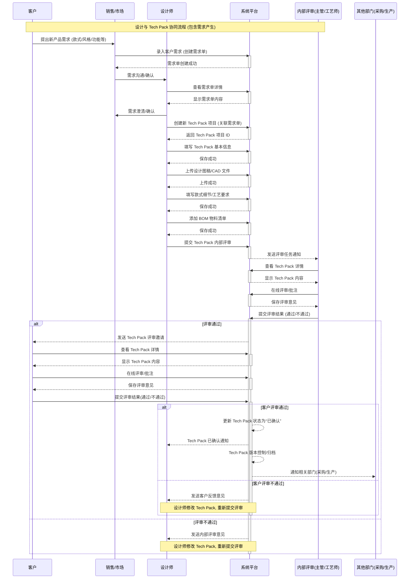

从需求产生到 Tech Pack 确认的整个流程：

**修改说明:**

1.  **新增参与者:**
    *   **Sales (销售/市场):**  负责接收客户需求并将其转化为系统中的需求单的角色。

2.  **新增流程步骤 (需求产生):**
    *   `Client->>Sales: 提出新产品需求 (款式/风格/功能等)`: 客户向销售/市场人员提出新的产品需求。
    *   `Sales->>System: 录入客户需求 (创建需求单)`: 销售/市场人员在系统中创建需求单，记录客户的需求信息。
    *   `Sales->>Designer: 需求沟通/确认`: 销售/市场人员与设计师进行需求沟通，确保设计师理解客户需求。
    *   `Designer->>System: 查看需求单详情`: 设计师在系统中查看需求单的详细内容。
    *    `Designer->>Sales: 需求澄清/确认`: 设计和销售做进一步需求澄清.
    *   `Designer->>System: 创建新 Tech Pack 项目 (关联需求单)`: 设计师在系统中创建新的 Tech Pack 项目，并将其与相应的需求单关联起来。

3.  **关键变化:**
    *   Tech Pack 项目的创建现在与需求单相关联，确保设计工作始终以客户需求为导向。
    *   增加了销售/市场人员的角色，明确了需求收集和转化的职责。

通过这些修改，序列图现在更完整地展现了从需求产生到 Tech Pack 确认的整个流程，也更符合实际的业务场景。 这样修改后，序列图就能够更全面地反映整个流程了。
