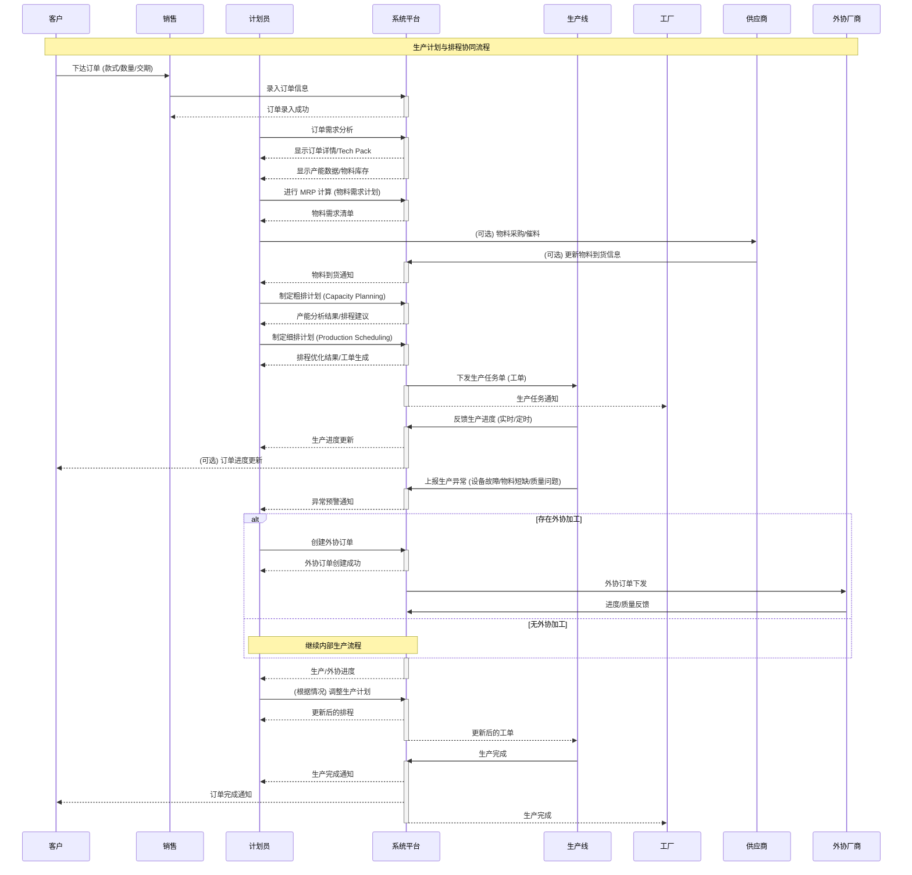

这个序列图将涵盖从需求分析到生产完成的完整流程，并突出系统在其中的作用，以及各角色之间的交互。

**序列图说明:**

1.  **参与者:**
    *   **Client (客户):** 下达订单。
    *   **Sales (销售):** 录入订单信息到系统。
    *   **Planner (计划员):** 负责需求分析、产能评估、生产计划制定、生产进度监控、计划调整等。
    *   **System (系统平台):** 提供订单管理、MRP 计算、产能分析、排程优化、工单生成、进度跟踪、异常预警等功能。
    *   **ProductionLine (生产线):** 执行生产任务，反馈生产进度和异常情况。
    *   **Factory (工厂):** 接收生产任务通知，组织生产。
        * **Supplier (供应商):** 物料采购
    *   **External Processor(外协厂商)**: 接收外协订单, 进行进度/质量反馈

2.  **流程步骤:**
    *   客户下达订单，销售录入订单信息到系统。
    *   计划员进行订单需求分析，查看订单详情、Tech Pack、产能数据、物料库存等。
    *   计划员进行 MRP 计算，生成物料需求清单。
    *   （可选）计划员向供应商进行物料采购或催料, 供应商更新到货信息.
    *   计划员制定粗排计划（Capacity Planning）和细排计划（Production Scheduling）。
    *   系统下发生产任务单（工单）到生产线，并通知工厂。
    *   生产线实时或定时反馈生产进度。
    *   生产线上报生产异常（设备故障、物料短缺、质量问题等）。
    *   如果存在外协加工：
        *   计划员创建外协订单。
        *   系统下发外协订单给外协加工厂。
        *   外协厂商反馈进度与质量
    *   否则，继续内部生产流程。
    *   计划员根据实际情况调整生产计划。
    *   生产线完成生产，系统通知计划员和客户。

3.  **关键交互:**
    *   `activate` 和 `deactivate` 标注了系统平台在处理请求时的激活和释放状态。
    *   `alt` 和 `else` 标注了是否存在外协加工的不同分支流程。
    *   `(可选)` 标注了可选的流程步骤（如物料采购、客户订单进度更新）。
    *    双向箭头表示信息的请求和响应. 单向箭头则表示信息通知

这个序列图清晰地展现了“生产计划与排程协同”模块中各个角色和系统之间的交互过程，以及流程的流转和关键节点。它有助于我们更好地理解模块的运作机制，并为后续的开发和实施提供指导。